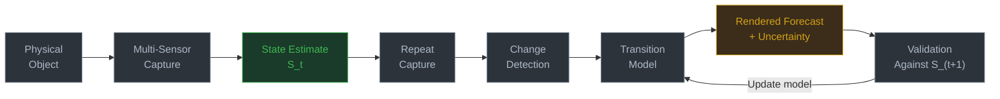
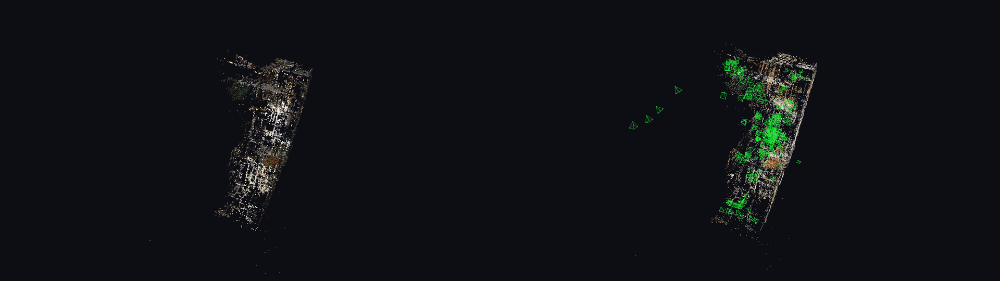
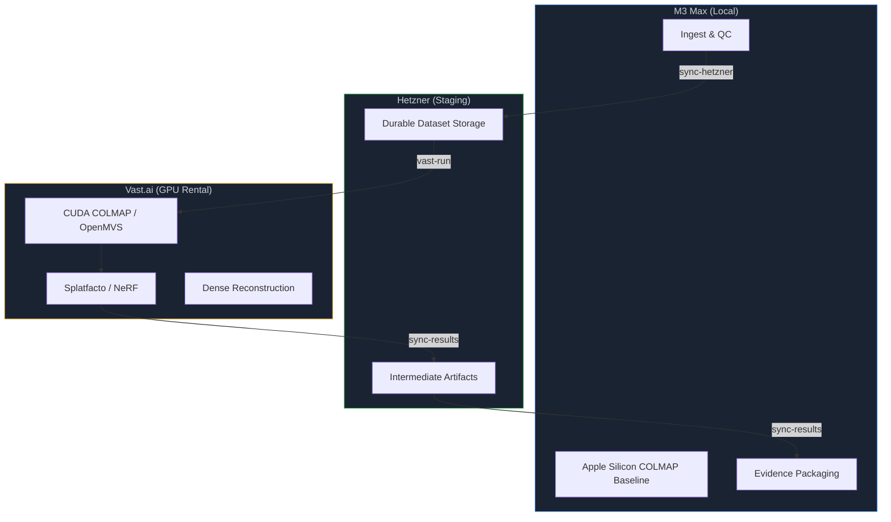

<p align="center">
  <strong>W H A T &nbsp; W E &nbsp; S E E</strong>
</p>

<p align="center">
  <em>The future image is not a photograph.<br>It is a visualization of a modeled probability distribution.</em>
</p>

<p align="center">
  
  
  
  
</p>

---

## What Is This?

A research system for generating **rendered forecasts** — future-state images of physical environments constrained by measured reality, not AI imagination.

The core claim: once 3D capture becomes multi-sensor, calibrated, semantically annotated, and repeated over time, a scan is no longer just a scan. It becomes a **state estimate** — a measured, uncertain representation of a physical system at a specific time. Future images generated from that state are visualizations of modeled probability distributions, constrained by evidence and falsifiable against later captures.

This framework is grounded in the **EU VIGIE 2020/654** report on 3D digitisation quality, read not as a heritage-archiving document but as a systems paper about how physical things become computationally observable, comparable, and eventually predictive. Supplemented by 44 extracted texts from the Time Machine consortium.

---

## The Idea in One Diagram



The validation loop is the critical difference between this system and generative AI. The next capture is the ground truth test for the previous forecast. Without it, you have beautiful images with no evidential discipline.

---

## Core Concepts

| Concept | Meaning |
|:---|:---|
| **State Estimate (S_t)** | A measured, uncertain representation of a physical entity at a specific time. S_t = {Geometry, Materials, Uncertainty, Labels, Provenance}. |
| **Semantic 3D Time Series** | Repeated, registered captures with geometry, material signals, and semantic labels — the raw input for change detection. |
| **Temporally Grounded Digital Twin** | A living state model linked to evidence, history, environment, and uncertainty — not a static 3D model. |
| **Rendered Forecast** | A generated visualization of probable future physical states — constrained by evidence, not imagined. |
| **Evidence / Inference / Visualization** | The epistemic backbone. Raw sensor data ≠ derived interpretation ≠ presentation output. These must never be conflated. |
| **Uncertainty Field** | Spatial, material, semantic, or temporal uncertainty attached to every point in a model — first-class, not optional. |
| **Probability Defocus** | Visual language where uncertain regions are rendered less sharply — the image *shows* what it doesn't know. |
| **Validation Loop** | Future capture compared to prior forecast. Forecast scored. Model updated. This is what makes it science. |

---

## Research Foundation

This isn't a weekend project. The intellectual framework spans 7 theory files, 11 paper-digest files, and 6 implementation documents.

<details>
<summary><strong>Primary Anchor</strong></summary>

**VIGIE 2020/654** — *Study on quality in 3D digitisation of tangible cultural heritage*, published by the Publications Office of the European Union, 2022. A 205-page, 7-chapter report defining quality across geometric accuracy, radiometric fidelity, spatial resolution, semantic completeness, metadata quality, interoperability, and provenance. This project reads those quality dimensions as state-estimation requirements.

</details>

<details>
<summary><strong>Supplementary Corpus — 44 Time Machine Texts</strong></summary>

Extracted from the Time Machine consortium covering 4D information systems, FAIR 3D data, digital twins, historical GIS, and AI-assisted enrichment. These provide the "what others have tried" context for positioning rendered forecasts as a novel contribution.

</details>

<details>
<summary><strong>External Anchors</strong></summary>

London Charter · Seville Principles · CIDOC CRMdig · M3C2 · COLMAP · GLOMAP · 3D Gaussian Splatting · D-NeRF · 4D Gaussian Splatting · Nerfstudio · VGGT

</details>

<details>
<summary><strong>Theory Spine (7 files)</strong></summary>

1. **Scan as State Estimate** — The foundational abstraction: S_t = {G, M, Σ, L, P}
2. **Semantic 3D Time Series** — Repeated registered captures as structured time series
3. **Temporally Grounded Digital Twin** — From static model to living state representation
4. **Generative World Models** — How world models constrain future-state generation
5. **Future-State Rendering** — Rendered forecasts vs. generative AI: the critical distinction
6. **Uncertainty Visualization** — Probability defocus and confidence-mapped rendering
7. **Validation Loop** — How the system becomes scientific and self-correcting

</details>

---

## What's Built

Three integrated subsystems. Working code, not just theory.

### Photogrammetry Pipeline — [`photogrammetry/`](photogrammetry/)

`pgm.py` — a 121KB Click CLI spanning the full capture-to-render workflow:

```
init-dataset → ingest → convert-raw → qc → cloud-plan → sync-hetzner → vast-run → sync-results
```

- **Local:** Ingest, quality control, and Apple Silicon COLMAP/GLOMAP baseline on M3 Max
- **Staging:** Durable intermediate storage on Hetzner
- **GPU:** COLMAP, OpenMVS, and Splatfacto execution on Vast.ai rental GPUs
- **Multi-camera:** Merge-candidate system for datasets from multiple capture devices

### GPU Runtime — [`gpu/`](gpu/)

Shared GPU rental layer with infrastructure discipline:

- Bootstrap and preflight validation scripts — no GPU launch without passing checks
- CUDA COLMAP source builds for rental instances
- Cost-control gates: explicit confirmation required before spend
- Five-class artifact contract for GPU outputs

### Evidence Layer — [`evidence/`](evidence/)

`evidence.py` — a 40KB CLI for structured evidence packaging:

- JSON schemas enforcing artifact classification (evidence / inference / visualization)
- Links photogrammetry datasets into evidence packages with full provenance
- Ensures epistemic categories are never silently conflated

---

<p align="center">

```
~6,600 lines Python  ·  ~1,100 lines Shell  ·  40 markdown docs
199 total files  ·  44 research PDFs  ·  7 theory + 11 paper + 6 implementation docs
```

</p>

---

## Current Status — Basement S₀

The pipeline is real. It runs on real data.

| Detail | Value |
|:---|:---|
| **Target** | Basement and indoor garden |
| **Capture date** | April 28, 2026 |
| **Working images** | 308 (iPhone) |
| **Registration** | 305/308 images registered by COLMAP global_mapper |
| **Processing time** | ~41 minutes on M3 Max |
| **Sparse points** | 73,367 |
| **Mean reprojection error** | 0.000363 px |
| **Current stage** | Staged on Hetzner for Splatfacto GPU pass (30k iterations) |
| **Next milestone** | Repeat capture S₁ → register → measure change → first forecast |

---

## Experiment Roadmap

Six phases from first capture to validated forecasts:

```
Phase 1          Phase 2          Phase 3              Phase 4             Phase 5          Phase 6
Baseline ──────► Semantic ──────► Change ────────────► Forecast ─────────► Validation ────► Loop
State            State            Detection            Rendering           Against S₂       Update &
Capture S₀       Labels &         S₁ vs S₀             Conservative        Score             Improve
                 Metadata         M3C2                 + Uncertainty        Residuals
━━━━━━━━━━━━━━━━━━━━━━━━━━━━━━━━━━━━━━━━━━━━━━━━━━━━━━━━━━━━━━━━━━━━━━━━━━━━━━━━━━━━━━━━━━━
▲ HERE
```

**Phase 1** (in progress): Baseline capture complete. Sparse reconstruction validated. Staged for dense reconstruction and Splatfacto rendering.

<p align="center">
  
  <br><sub><em>Sparse point cloud (left) and 305-registered-camera pose network (right).<br>COLMAP global_mapper, M3 Max, ~41 min. Mean reprojection error: 0.000363 px.</em></sub>
</p>

---

## Three-Machine Architecture



Every transition has validation gates. GPU instances don't launch without preflight checks. Cost is explicitly confirmed before spend.

---

## Project Philosophy

> *The future image is not a photograph; it is a visualization of a modeled probability distribution. The serious work is not generating the image. The serious work is constraining the image with measured reality and validating it against later captures.*

> *Prefer an ugly forecast with calibrated uncertainty over a beautiful forecast with no evidential discipline.*

This project takes a position: **falsifiability over fidelity**. Every forecast is a hypothesis. Every subsequent capture is a test. The system is designed to be wrong in measurable, improvable ways — not to produce impressive images that can never be checked.

---

## Repository Map

```
whatwesee/
├── Research/                   # Theory, paper digest, implementation plans
│   ├── paper/                  # 11 files digesting VIGIE 2020/654
│   ├── theory/                 # 7 files: core intellectual framework
│   ├── implementation/         # 6 files: data, pipeline, roadmap
│   └── timemachine/            # 44 extracted Time Machine consortium texts
├── photogrammetry/             # Working CLI pipeline (pgm.py, 121KB)
│   ├── scripts/                # CLI source + remote execution scripts
│   ├── docs/                   # Pipeline docs + S₀ status
│   └── configs/                # Pipeline configuration templates
├── gpu/                        # Shared GPU rental runtime
│   ├── scripts/                # Bootstrap, preflight, CUDA builds
│   └── configs/                # Runtime configuration templates
├── evidence/                   # Structured evidence packaging (evidence.py, 40KB)
│   ├── scripts/                # CLI source
│   └── schemas/                # JSON schemas for artifact classification
└── README.md                   # ← You are here
```

---

## Getting Started

This is a research prototype. The pipeline assumes a specific infrastructure topology:

- **Local:** macOS with Apple Silicon (M3 Max tested)
- **Staging:** Hetzner dedicated server (configure your own `$STAGING_HOST`)
- **GPU:** Vast.ai rental instances with CUDA support

See [`photogrammetry/README.md`](photogrammetry/README.md) for pipeline setup, [`gpu/README.md`](gpu/README.md) for GPU runtime configuration, and [`evidence/README.md`](evidence/README.md) for evidence packaging.

---

## License

MIT

---

<p align="center">
  <sub>Built by <strong>Collin Wiggins</strong> · Systems, not titles</sub>
</p>
