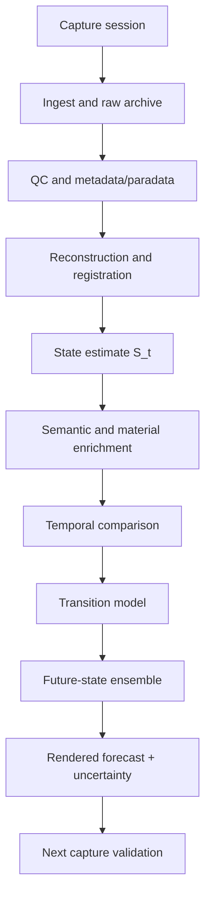
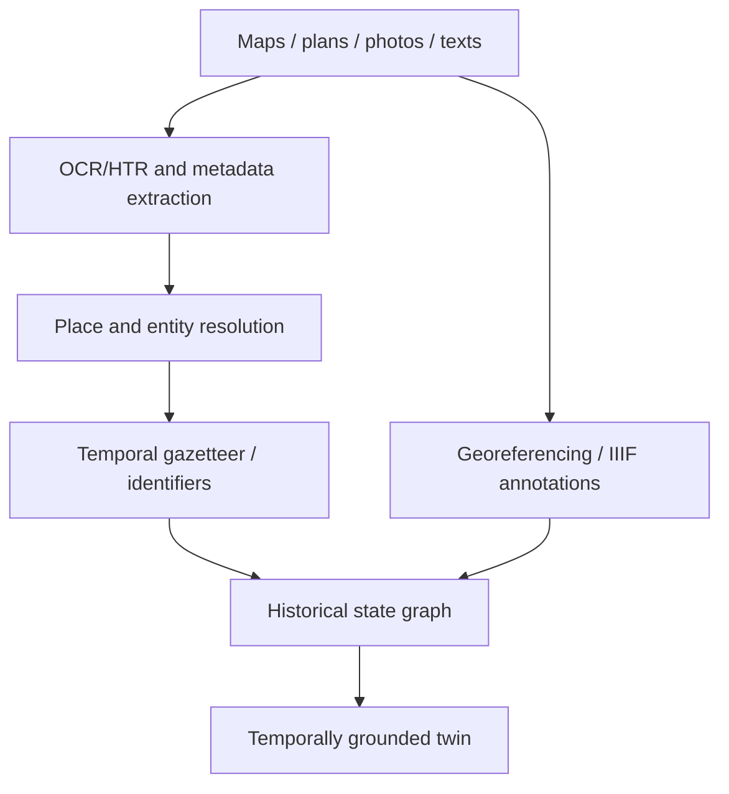

# Pipeline Architecture

## Purpose
Translate the research thesis into an implementable pipeline from capture to rendered forecast.

## Core Claim
The project should be built as a staged evidence pipeline. Each stage should preserve provenance, uncertainty, and the distinction between measured evidence, derived inference, and visualization.

## Agent Takeaways
- Build state estimates before building future renders.
- Use the photogrammetry pipeline for image ingest, QC, COLMAP/OpenMVS, and Gaussian splats.
- Add temporal registration, semantic labels, uncertainty fields, and validation artifacts.
- Keep future-state generation downstream of measured state and change analysis.

## Paper Grounding
- Section 2.3, report pp. 6-7: digitisation requires planned stages, deliverables, metadata, paradata, archive, and sign-off.
- Section 2.10, report p. 22: raw capture produces derived data layers.
- Section 4, report pp. 72-82: formats and standards affect preservation and interoperability.
- Section 5.7-5.9, report pp. 87-88: cloud, semantic enrichment, AI/ML, and monitoring become part of future workflows.

## Architecture

## Parallel Archival Ingest Path
Physical capture is only one evidence stream. The Time Machine path adds archival and spatial-temporal ingest:

This path should use source citations, temporal validity, uncertainty, and paradata. It can constrain future-state imaging by exposing prior repairs, historical materials, missing states, and long-term environmental context.

## Stage Responsibilities
| Stage | Responsibility |
| --- | --- |
| Capture | collect RAW/JPEG, LiDAR, thermal, spectral, control targets, notes. |
| Ingest/QC | checksums, EXIF, blur/exposure checks, folder conventions, previews. |
| Reconstruction | COLMAP/OpenMVS/RealityCapture/VGGT/DUSt3R experiments as appropriate. |
| Registration | align captures to a stable coordinate frame and prior states. |
| Enrichment | masks, semantic labels, material/condition annotations. |
| Change detection | compare `S_t` to `S_t-1` with uncertainty thresholds. |
| Prediction | estimate future state or future-state distribution. |
| Rendering | visualize forecast and uncertainty. |
| Validation | compare forecast to later capture and update model. |
| Archival ingest | collect maps, plans, archival photos, text records, existing models, rights, and source metadata. |
| Place resolution | reconcile names, addresses, coordinates, temporal validity, and source confidence. |
| Data-space packaging | create raw archive, derivative viewer assets, metadata, paradata, rights, PIDs/stable IDs, and validation notes. |

## Evidence / Inference / Visualization
Pipeline outputs should be tagged:

- `evidence`: raw data, calibration, sensor logs;
- `inference`: reconstruction, labels, change maps, predicted states;
- `visualization`: rendered images, splats, public views, explanatory graphics.

## Future-State Imaging Implication
Future-state rendering becomes a pipeline product, not an isolated prompt. The renderer should receive a predicted state plus uncertainty fields and should output a forecast package that can be validated later.

## Standards-Informed Package
A minimum forecast package should contain:

- input state IDs and source capture sessions;
- raw-evidence links and checksums;
- derived geometry/representation links;
- metadata/paradata/provenance record;
- semantic labels and evidence taxonomy;
- transition model or scenario description;
- uncertainty field and ensemble metadata;
- rendered forecast outputs;
- validation placeholder for the next capture.

This aligns with the spirit of Europeana EDM separation, CRMdig/PROV-O provenance, RO-Crate packaging, and EUreka3D/3DBigDataSpace-style data-space publication. It is stricter than public-viewer requirements because future-state imaging must remain testable.

## First Implementation Target
The first target should be a small object or surface with:

- repeatable capture;
- existing photogrammetry pipeline output;
- one semantic region of interest;
- simple change map;
- a conservative future-state visualization.
