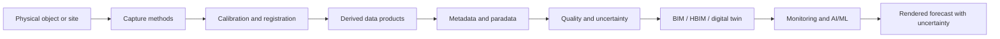

# Paper Map

## Purpose
Provide an audit map for the VIGIE 2020/654 report so agents can locate claims, section anchors, and the paper-to-project bridge without rereading the full PDF.

## Core Claim
The report is formally about quality in 3D digitisation of tangible cultural heritage, but its structure describes a general system for turning physical reality into calibrated, documented, reusable, and eventually predictive computational state.

## Agent Takeaways
- Use the PDF in `Research/` as the canonical source.
- Cite paper claims with report section and report page references.
- Treat all future-state imaging claims as synthesis unless the report explicitly discusses digital twins, AI/ML, prediction, or monitoring.

## Paper Grounding
- Source PDF: [../KK0521128ENN_yK2T3mg7kjhSifoxSuRP8SJw48_86092.pdf](../KK0521128ENN_yK2T3mg7kjhSifoxSuRP8SJw48_86092.pdf)
- Title: `Study on quality in 3D digitisation of tangible cultural heritage: mapping parameters, formats, standards, benchmarks, methodologies, and guidelines`
- Identifier: VIGIE 2020/654, Final Study Report.
- Published by: Publications Office of the European Union, 2022.
- Main contractor: Cyprus University of Technology, Digital Heritage Research Lab.
- Official source: [EU Publications Office](https://op.europa.eu/en/publication-detail/-/publication/c0beb2b0-e21b-11ec-a534-01aa75ed71a1)

## Report Section Map
| Report area | Pages | Why it matters |
| --- | ---: | --- |
| 1. Preface | 3 | Establishes tasks: complexity, quality, standards, benchmarks, purposes of use. |
| 2.1 State of play | 4-5 | 3D digitisation is already infrastructure for research, education, creative work, XR, repositories, conservation, and structural assessment. |
| 2.2 Accuracy and precision | 6 | Separates accuracy, precision, and resolution; this is mandatory for prediction and validation. |
| 2.3 Planning the process | 6-7 | Treats digitisation as a production workflow with roles, methods, metadata, paradata, deliverables, and archive strategy. |
| 2.4 Documentation methods | 8-11 | Surveys tactile methods, GNSS, total stations, LiDAR, photogrammetry, X-ray, infrared, and method selection. |
| 2.5 Active/passive recording | 12-16 | Defines active sensors and passive image-based methods. |
| 2.6 Multi-sensory/multi-spectral | 17-18 | Moves from surface geometry to material state, spectra, stratigraphy, reflectance, and internal structure. |
| 2.7-2.9 Acquisition and condition | 19-21 | Explains capture constraints: access, lighting, weather, reflectivity, translucency, surface condition. |
| 2.10 Derived project data | 22 | Establishes that raw capture becomes a pipeline of derived artifacts. |
| 3. Complexity | 23-72 | Defines complexity as a relation among object, process, technology, environment, expertise, and intended use. |
| 3.1 Uncertainty | 25-26 | Frames uncertainty as central to measurement quality. |
| 3.6-3.12 Process complexity and quality | 47-71 | Shifts from object complexity to process/model complexity; defines quality layers and uncertainty sources. |
| 4. Standards and formats | 72-82 | Covers data types, file formats, metadata schemas, preservation, interoperability gaps. |
| 5. Future tech | 83-88 | Links XR, 5G, LiDAR, JPEG XL, BIM/HBIM/HHBIM, digital twins, cloud, open data, AI/ML, blockchain. |
| 6. Conclusions | 89-90 | Summarizes lack of accepted standards and the importance of paradata, repeatability, multimodality, registration, and interoperability. |

## Time Machine Corpus Ledger
These 44 local extracts are adjacent sources, not replacements for VIGIE. Use them to expand the project from high-quality 3D digitisation into 4D evidence infrastructure, data spaces, historical GIS, HBIM, virtual museums, and AI-assisted enrichment. Thin extracts are retained in the ledger so agents know they were seen but should not over-weight them.

| Local extract basename | Weight | Main use in this corpus |
| --- | --- | --- |
| `06proposal-revised-jan-2022-9cf23d1755.txt` | medium | Local Time Machine proposal; useful for bounded 4D research framing. |
| `1211077en-487a6eb320.txt` | medium | European Parliament policy context for AI, FAIR access, and data infrastructure. |
| `14-f41e973b79.txt` | low | Urban/architectural history session marker; trend signal only. |
| `15-74fcdaaad1.txt` | low | FAIR 3D cultural heritage session marker; trend signal for standards pressure. |
| `16-4191f28518.txt` | low | HBIM and climate-change preservation session marker. |
| `8-03c69ae2d3.txt` | low | Architectural/urban history data and technology session marker. |
| `978-3-031-43363-4-72c8b8a76c.txt` | high | Handbook-scale source for digital 3D reconstruction, paradata, 4D, photogrammetry, visualization, and NeRF-adjacent methods. |
| `978-3-031-78590-0-031c6dcfa6.txt` | high | State-of-the-art volume on 3D reconstruction, FAIRness, digital twins, paradata, and uncertainty. |
| `978-3-031-78590-0-6-3280b9f966.txt` | high | Europeana Data Model extension source; object/representation/aggregation distinctions. |
| `ai-for-3d-digital-twins-in-cultural-heritage-1437e35861.txt` | medium | AI/digital-twin cultural heritage policy and practice event. |
| `beyond-virtual-museums-workbook-powered-by-transmixr-b39bd947e4.txt` | medium | XR and virtual museum workflows; useful for forecast playback and viewer design. |
| `data-synergy-call-evaluation-questions-4db0827bf0.txt` | low | Funding/evaluation context; weak technical evidence. |
| `engaging-europe-s-heritage-5dculture-and-carare-unite-for-twin-it-f5a22c0f60.txt` | medium | 5Dculture/CARARE/Europeana data-space reuse context. |
| `furche-nr-50-2021-interview-t-aigner-6aa71242c6.txt` | low | Public Time Machine framing; useful only as rhetoric context. |
| `map-portals-and-databasis-of-towns-in-ce-a4d496070b.txt` | medium | Historical city map portals and databases; supports temporal GIS scaffolds. |
| `press-release-bigdataspace-kick-off-515c19fcfb.txt` | medium | 3DBigDataSpace kickoff; current 3D data-space implementation signal. |
| `press-release-grant-winners-e89959df87.txt` | medium | Grant winners, FAIR 3D, paradata, photogrammetry, and 4D project ecosystem. |
| `press-release-introducing-3dbigdataspace-af0ab155bf.txt` | medium | 3DBigDataSpace goals: aggregation, AI enrichment, Europeana, 3D/4D access. |
| `programm-tm-info-day-at-2020-1-77452dbc26.txt` | low | Time Machine information-day context; institutional trend signal. |
| `publication-handbook-of-digital-3d-reconstruction-of-historical-architecture-04bbd04420.txt` | medium | Handbook front matter and structure. |
| `publication-handbook-of-digital-3d-reconstruction-of-historical-architecture-10b63cf711.txt` | high | Scholarly method, paradata, reconstruction evidence, and uncertainty. |
| `publication-handbook-of-digital-3d-reconstruction-of-historical-architecture-2ad3f19831.txt` | high | Documentation, FAIR 3D, photogrammetry, uncertainty, and paradata. |
| `publication-handbook-of-digital-3d-reconstruction-of-historical-architecture-3575eaa16b.txt` | high | Infrastructure, Time Machine, Europeana, GIS, and visualization. |
| `publication-handbook-of-digital-3d-reconstruction-of-historical-architecture-4b65940969.txt` | medium | Introduction to 4D architectural and urban history. |
| `publication-handbook-of-digital-3d-reconstruction-of-historical-architecture-6be8417f30.txt` | high | 3D modeling, photogrammetry, LiDAR, NeRF-adjacent methods, and visualization. |
| `publication-handbook-of-digital-3d-reconstruction-of-historical-architecture-8bb092c1f0.txt` | low | Legislation and FAIR context. |
| `publication-handbook-of-digital-3d-reconstruction-of-historical-architecture-ad78362145.txt` | high | Basics and definitions for 4D, paradata, photogrammetry, GIS, and visualization. |
| `publication-handbook-of-digital-3d-reconstruction-of-historical-architecture-b16c3f6efd.txt` | high | Workflows for reconstruction and historical 3D production. |
| `publication-handbook-of-digital-3d-reconstruction-of-historical-architecture-f730f7d6f2.txt` | high | Visualization, uncertainty, source projection, and photorealism cautions. |
| `publication-handbook-of-digital-3d-reconstruction-of-historical-architecture-fc6eda5d9f.txt` | medium | Scholarly community and Europeana-facing context. |
| `shaping-the-future-of-urban-and-architectural-history-in-the-digital-age-1e2782f353.txt` | low | Low-content machine-learning session title; trend signal only. |
| `shaping-the-future-of-urban-and-architectural-history-in-the-digital-age-71fca26940.txt` | medium | Urban/architectural history proceedings context. |
| `shaping-the-future-of-urban-and-architectural-history-in-the-digital-age-9ac2417816.txt` | low | Low-content education session title. |
| `shaping-the-future-of-urban-and-architectural-history-in-the-digital-age-bbcd85014d.txt` | low | Low-content theory/methods session title. |
| `shaping-the-future-of-urban-and-architectural-history-in-the-digital-age-dc1405b9b3.txt` | low | Low-content visualization/presentation session title. |
| `shaping-the-future-of-urban-and-architectural-history-in-the-digital-age-f96d3193ac.txt` | low | Low-content data handling/data schemes session title. |
| `sn-bpf-en-67d9f25ba5.txt` | low | Book proposal form; weak evidence, but useful for corpus provenance. |
| `study-on-quality-in-3d-digitisation-of-tangible-cultural-heritage-778cdad36e.txt` | medium | Time Machine copy of VIGIE-related study page; cross-reference only. |
| `time-machine-factsheet-interactive-web-10c8bfa8ff.txt` | high | Big Data of the Past, 4D, FAIR, and AI framing. |
| `time-machine-in-finland-study-by-j-henriksson-b21c494ca1.txt` | high | National/local Time Machine study; metadata, GIS, FAIR, AI, and Europeana context. |
| `time-machine-manifesto-c996348def.txt` | high | Big Data of the Past, Mirror World, Europeana, AI, and 4D ambition. |
| `time-machine-pillar-roadmaps-e97a764b7d.txt` | high | Roadmaps for 4D, data infrastructure, AI, FAIR, uncertainty, and digital twins. |
| `tmc21-putnina-cb2bc164f0.txt` | low | Local Time Machine project-network signal. |
| `tmo-operational-plan-2020-2021-9e8bb85f7a.txt` | high | Time Machine operational structure; LiDAR, Europeana, 4D, AI, and organization. |

## External Research Spine
Use these sources as a current web-research spine. Reliability labels are for this project, not universal judgments.

| Topic | Sources to prefer |
| --- | --- |
| VIGIE and source coverage | [EU Publications Office VIGIE](https://op.europa.eu/en/publication-detail/-/publication/c0beb2b0-e21b-11ec-a534-01aa75ed71a1) `primary`; local Time Machine extracts `primary/local`; [London Charter](https://londoncharter.org/introduction.html) `primary principles`. |
| Time Machine and Big Data of the Past | [CORDIS Time Machine fact sheet](https://cordis.europa.eu/project/id/820323) `primary`; [Time Machine Manifesto](https://www.timemachine.eu/time-machine-manifesto-unlock-the-ambitions-of-big-data-of-the-past/) `primary/project`; [A Digital 4D Information System on World Scale](https://www.mdpi.com/2076-3417/14/5/1992) `peer-reviewed`. |
| Data spaces and FAIR 3D | [EUreka3D Data Hub](https://eureka3d.eu/eureka3d-data-hub/) `primary/project`; [3DBigDataSpace](https://www.dataspace-culturalheritage.eu/en/projects/3dbigdataspace) `primary/project`; [E-ARK CITS 3D Heritage Model](https://3dhm.openpreservation.org/) `primary/spec`. |
| Metadata, paradata, provenance | [CIDOC CRMdig](https://cidoc-crm.org/crmdig/) `primary/spec`; [W3C PROV-O](https://www.w3.org/TR/prov-o/) `primary/spec`; [RO-Crate](https://www.researchobject.org/ro-crate/specification/1.0/index.html) `primary/spec`. |
| Historical GIS and temporal scaffolds | [World Historical Gazetteer](https://www.whgazetteer.org/) `primary/project`; [Harvard Temporal Gazetteer](https://gis.harvard.edu/temporal-gazetteer) `primary/project`; [Pelagios tools/resources](https://pelagios.org/lod/tools-resources) `primary/project`. |
| Open 3D repositories and benchmarks | [OpenHeritage3D data](https://openheritage3d.org/data) `primary/repository`; [OpenHeritage3D archival framework](https://isprs-archives.copernicus.org/articles/XLVIII-2-2024/241/2024/) `peer-reviewed`; [CULTURE3D](https://memories.ai/research/CULTURE3D) `research/project`; [ISPRS Benchmarks](https://www.isprs.org/resources/datasets/benchmarks/) `primary/benchmark`. |
| Capture and reconstruction | [COLMAP](https://colmap.github.io/) `primary/tool`; [OpenMVS](https://github.com/cdcseacave/openMVS) `primary/tool`; [3D Gaussian Splatting](https://repo-sam.inria.fr/fungraph/3d-gaussian-splatting/) `primary/paper`. |
| Point-cloud time series and validation | [M3C2 arXiv](https://arxiv.org/abs/1302.1183) `paper`; [CloudCompare M3C2](https://cloudcompare.org/doc/wiki/index.php/PluginM3C2) `tool docs`; [PDAL M3C2 filter](https://pdal.org/en/latest/stages/filters.m3c2.html) `tool docs`. |
| Material decay and predictive conservation | [Stone relic hyperspectral dataset](https://www.nature.com/articles/s41597-025-06158-3) `peer-reviewed dataset`; [Terahertz stone deterioration prediction](https://www.nature.com/articles/s40494-021-00502-7) `peer-reviewed`; [Historical Building Crack dataset](https://data.mendeley.com/datasets/xfk99kpmj9/1) `dataset`. |
| Dynamic radiance fields | [NeRF](https://arxiv.org/abs/2003.08934) `paper`; [D-NeRF](https://openaccess.thecvf.com/content/CVPR2021/html/Pumarola_D-NeRF_Neural_Radiance_Fields_for_Dynamic_Scenes_CVPR_2021_paper.html) `peer-reviewed`; [4D Gaussian Splatting CVPR 2024](https://openaccess.thecvf.com/content/CVPR2024/html/Wu_4D_Gaussian_Splatting_for_Real-Time_Dynamic_Scene_Rendering_CVPR_2024_paper.html) `peer-reviewed`. |
| Uncertainty visualization | [London Charter](https://londoncharter.org/introduction.html) `primary principles`; [Seville Principles](https://www.vi-mm.eu/wp-content/uploads/2016/10/The-Seville-Principles.pdf) `primary principles`; [probabilistic forecasting review](https://www.annualreviews.org/content/journals/10.1146/annurev-statistics-062713-085831) `peer-reviewed`. |
| World models and scenario engines | [World Models](https://arxiv.org/abs/1803.10122) `paper`; [Genie](https://arxiv.org/abs/2402.15391) `paper`; [predictive maintenance digital twins review](https://pmc.ncbi.nlm.nih.gov/articles/PMC10070392/) `peer-reviewed review`. |

## Topic Queue For Future Loops
1. VIGIE plus full local Time Machine source coverage.
2. Time Machine, 4D mirror worlds, and Big Data of the Past.
3. Europeana, EDM, 3DBigDataSpace, EUreka3D, FAIR 3D, and data-space infrastructure.
4. Metadata, paradata, CRMdig, computational provenance, and evidence-aware reconstruction.
5. Historical GIS, temporal gazetteers, local Time Machines, and city-scale temporal scaffolds.
6. Open 3D heritage repositories and benchmark datasets.
7. Capture and reconstruction methods: photogrammetry, LiDAR, COLMAP/GLOMAP, NeRF, Gaussian splatting.
8. Point-cloud time series, M3C2/M3C2-PM, registration uncertainty, and geometric validation.
9. Material decay and predictive conservation.
10. Dynamic NeRFs, 4D Gaussian splats, radiance-field conservation records, and forecast playback.
11. Uncertainty visualization: probability defocus, confidence fields, ensembles, evidence scales, ambiguity in viewers.
12. World models and scenario engines constrained by measured state.

## High-Level Flow

## Evidence / Inference / Visualization
- **Evidence**: raw photos, LiDAR scans, spectra, thermal images, control points, calibration records, environmental notes.
- **Inference**: registered point clouds, meshes, orthophotos, semantic labels, material classification, structural condition readings.
- **Visualization**: web models, XR scenes, renders, animations, restoration views, future-state forecasts.

## Future-State Imaging Implication
The report does not claim that AI can produce a measured record before later measurement occurs. It supplies the measurement and documentation logic required for a future-state rendering system: calibrated state estimation, repeated observation, semantics, paradata, uncertainty, and validation.
