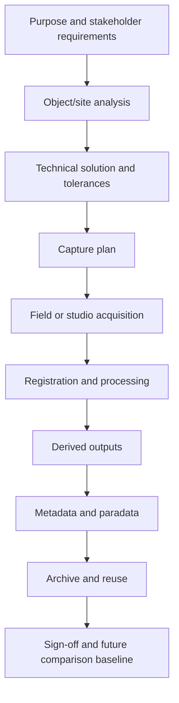

# Digitisation As Process

## Purpose
Document the report's treatment of digitisation as a planned production workflow rather than a casual capture event.

## Core Claim
The trustworthiness of a digital twin begins before the first photo or scan. Planning, capture design, dimensional integrity, production management, metadata, paradata, file strategy, backup, and sign-off are part of the measurement system.

## Agent Takeaways
- Treat capture as a production pipeline with explicit roles and checkpoints.
- Record purpose, methods, tolerances, file conventions, metadata, paradata, archive plan, and deliverables.
- The capture process is part of the data.
- Digital-twin and prediction work fails if the capture process is undocumented.

## Paper Grounding
- Section 2.3, report pp. 6-7: project planning includes management, site/object analysis, technical solution, dimensional integrity, recording methods, production, outputs, backup, archive, metadata, paradata, and sign-off.
- Section 2.4, report pp. 8-9: method choice follows stakeholder requirements and level of detail.
- Section 4, report pp. 72-74: project standards and deliverables must be defined in relation to goals, formats, preservation, and reuse.

## Process Pattern


## Expanded Process Pattern
The Time Machine and data-space sources add an archival/semantic process beside physical capture:

```text
source discovery -> rights/access -> digitisation or ingest -> metadata
-> place/time/entity resolution -> paradata/provenance -> repository package
-> 4D evidence graph -> twin update
```

This matters because a future-state renderer may need not only the latest scan, but a repair record, a historical photograph, a moisture event, an older map, or a prior reconstruction. Those records must enter through a documented process just like a LiDAR scan.

## What Must Be Captured About The Capture
- Why the digitisation was done.
- What object or site was captured.
- Which sensors, lenses, scanners, targets, and software were used.
- What accuracy, resolution, and error tolerance were expected.
- What environmental conditions existed.
- What processing steps changed raw evidence.
- What deliverables were produced.
- What limitations remain.

## Future-State Imaging Implication
A future-state renderer needs past states that are comparable. That comparability is produced by process discipline: same coordinate frame, known scale, known sensor limits, known processing steps, and repeatable capture conditions. Without that, apparent change may be caused by workflow variation rather than physical transition dynamics.

For data-space publication, process should produce raw archives, derived assets, viewer derivatives, metadata, paradata, rights/access records, persistent or stable IDs, and validation placeholders. The goal is not bureaucracy. It is to make later agents able to tell which files can constrain a rendered forecast and which files are only presentation outputs.

## Evidence / Inference / Visualization
Planning documents are not administrative leftovers. They are part of the evidence chain. They tell future systems whether a mesh is measured, smoothed, manually repaired, AI-infilled, or merely rendered.
