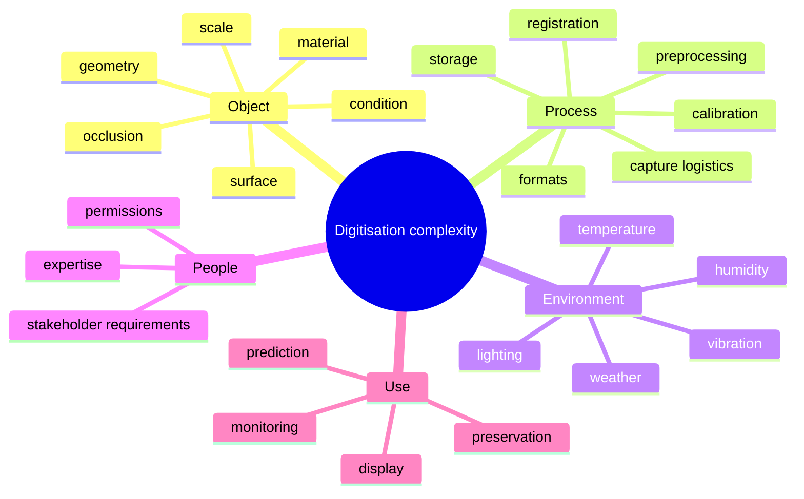

# Complexity

## Purpose
Explain how the report reframes complexity as a relationship among the object, method, environment, process, stakeholders, and intended use.

## Core Claim
Complexity is not just that an object is hard to scan. It is the interaction between what the object is, what needs to be known, how it can be measured, under what conditions, by which operators, and with what tolerance for uncertainty.

## Agent Takeaways
- Avoid treating complexity as polygon count.
- Plan from required model/use backward to capture strategy.
- Include environment, access, permissions, equipment, expertise, processing, and archive burden.
- For prediction, complexity includes temporal repeatability and comparable future captures.

## Paper Grounding
- Section 3, report pp. 23-24: complexity is a recurring but inconsistently used concept in 3D digitisation.
- Section 3, report p. 24: complexity connects stakeholder requirements, quality, accuracy, expertise, completeness, object size, and requirements.
- Section 3.6, report pp. 47-50: object and process complexity include visible surfaces, occlusion, size, point-cloud registration, material, geometry, and environment.
- Section 3.9-3.10, report pp. 51-66: the report shifts from object complexity to process/model complexity and proposes the Data Acquisition Process Management System.

## Complexity Layers

## Future-State Imaging Implication
Prediction adds temporal complexity. It is not enough to scan once. The project must support repeated comparable observations:

- the same coordinate frame;
- compatible sensor settings;
- known environmental conditions;
- stable semantic labels;
- uncertainty carried forward;
- comparable output formats.

The Time Machine/data-space layer adds institutional and semantic complexity:

- source rights and access may determine what can be reused;
- historical names, boundaries, and identities can change;
- datasets may have uneven metadata and missing paradata;
- public viewer assets may be detached from raw evidence;
- beautiful reconstructions may contain undocumented hypotheses;
- AI enrichment may add labels without sufficient confidence.

Complexity is therefore the relationship between object, method, environment, process, institution, representation, intended use, and uncertainty tolerance.

## Evidence / Inference / Visualization
Complexity should be represented as metadata and paradata, not hidden in operator memory. If a future-state image depends on a difficult scan region, the visualization should show lower confidence there.
