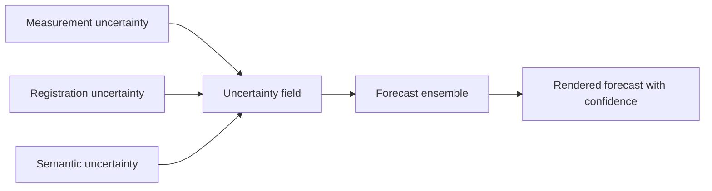

# Uncertainty

## Purpose
Explain the report's uncertainty framing and connect it to honest future-state prediction.

## Core Claim
A serious scan is not simply true. It is a measurement with uncertainty from instruments, calibration, registration, environment, material behavior, operators, assumptions, and processing. Future-state rendering must preserve that uncertainty rather than hiding it behind photorealism.

## Agent Takeaways
- Treat uncertainty as first-class data.
- Distinguish error from uncertainty.
- Attach uncertainty to geometry, material labels, registration, semantics, and forecasts.
- A future render without uncertainty metadata is incomplete.

## Paper Grounding
- Section 3.1, report pp. 25-26: uncertainty should be expressed consistently and transferably for measurement.
- Section 3.12.1, report p. 71: uncertainty is proposed as a general expression of quality in 3D digitisation.
- Section 3.12.1, report p. 71: sources include stakeholder constraints, unskilled personnel, non-calibrated equipment, resolution differences, environmental effects, undefined measurands, external data, assumptions, and variations in repeated observations.

## Uncertainty Types
| Type | Example |
| --- | --- |
| Measurement uncertainty | scanner noise, image blur, depth quantization. |
| Calibration uncertainty | lens model error, uncalibrated LiDAR/camera alignment. |
| Registration uncertainty | point-cloud alignment residuals, SLAM drift. |
| Surface uncertainty | occlusion, reflectivity, translucency, vegetation, shadows. |
| Material uncertainty | ambiguous spectra, emissivity assumptions, moisture effects. |
| Semantic uncertainty | crack vs stain, repair vs original material. |
| Forecast uncertainty | multiple plausible future trajectories. |

## Registration And Change Uncertainty
The project should treat registration uncertainty as a first-class risk. A tiny apparent displacement can be a real crack movement, a registration residual, a changed surface normal, a photogrammetry precision artifact, vegetation, lighting, or a LiDAR incidence-angle effect.

For point-cloud time series, M3C2-style methods are valuable because they compare clouds along local surface normals and can attach confidence/level-of-detection logic to measured change. M3C2-PM is particularly relevant to photogrammetry because it uses precision maps rather than only roughness. M3C2-EP-style approaches point toward explicit propagation of measurement and alignment uncertainty. Sources: [M3C2](https://arxiv.org/abs/1302.1183), [CloudCompare M3C2](https://cloudcompare.org/doc/wiki/index.php/PluginM3C2), and [PDAL M3C2 filter](https://pdal.org/en/latest/stages/filters.m3c2.html).

## Material And Environmental Uncertainty
Material-state inference is conditional. Thermal, hyperspectral, moisture, and terahertz signals can reveal hidden state, but they are sensitive to emissivity, illumination, weather, calibration, material heterogeneity, surface coatings, prior interventions, and time since exposure. An anomaly map is evidence of a signal. "Moisture intrusion," "void," or "incipient failure" is an inference until corroborated.

## Future-State Imaging Implication
The correct future-state output is not one clean image. It is an ensemble or uncertainty-aware rendering. Stable regions can render sharply. Uncertain regions should carry probability defocus, confidence overlays, error bars, or alternative trajectories.

## Evidence / Inference / Visualization

## Practical Rule
If a region cannot be measured confidently today, it cannot be forecast confidently tomorrow.
