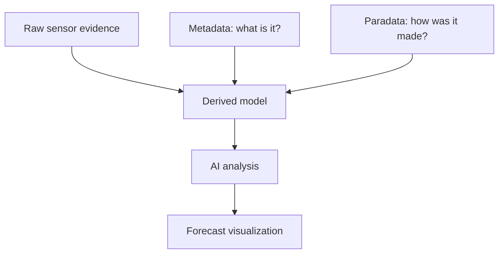

# Metadata And Paradata

## Purpose
Document why metadata and paradata are central to the project, especially for agents and generative systems.

## Core Claim
Metadata says what the object and data are. Paradata says how the data was produced and interpreted. Provenance records derivation history: actors, activities, tools, inputs, outputs, timestamps, and versions. Together they let future systems distinguish measured evidence from interpretation.

## Agent Takeaways
- Store metadata and paradata as first-class project artifacts.
- Store computational provenance separately enough that later agents can reconstruct the derivation chain.
- Every derived model must point back to source evidence and processing steps.
- Generative systems must know which surfaces are measured, inferred, repaired, simplified, or rendered.
- Without paradata, AI will confuse pretty reconstructions with measured reality.

## Paper Grounding
- Section 2.3, report pp. 6-7: project planning includes metadata and paradata records.
- Section 3.2, report pp. 31-32: the survey finds metadata is more common than paradata; many projects do not record process information.
- Section 4.3, report pp. 78-79: metadata schemas include Smithsonian 3D, LIDO, CARARE, ARCO, CRMdig, and METS.
- Section 5.6, report p. 86: HHBIM combines object metadata with paradata such as purpose, conditions, processing, equipment, methods, actors, technologies, and storytelling/memory.

## Metadata
Metadata describes:

- object identity;
- location;
- date;
- collection or project context;
- licensing and access;
- data type;
- file relationships;
- semantic descriptions.

## Paradata
Paradata describes:

- purpose of digitisation;
- capture conditions;
- equipment and calibration;
- operators and roles;
- processing pipeline;
- assumptions and limitations;
- quality targets;
- manual edits;
- generated or inferred regions.

## Provenance
Provenance describes:

- source files and identifiers;
- capture or processing activities;
- devices, software, model versions, and parameters;
- human and agent actors;
- derivation links among raw evidence, intermediate products, final models, and rendered forecasts;
- timestamps, environment, versions, checksums, and review status.

The practical distinction is:

```text
metadata   = what this thing/data is
paradata   = why and how interpretive decisions were made
provenance = how this artifact was derived from other artifacts
```

## Evidence Taxonomy
Use this vocabulary in annotations and forecast packages:

| Class | Meaning |
| --- | --- |
| observed | directly visible or sensor-observed in raw evidence. |
| measured | quantitatively captured with calibration, scale, and uncertainty. |
| documented | supported by archival text, plan, photo, map, or prior record. |
| inferred | derived from evidence by algorithm or expert reasoning. |
| analogical | based on comparison to similar objects, materials, or historical cases. |
| hypothetical | plausible but not directly evidenced. |
| AI-suggested | generated by a model and awaiting review or validation. |

Every reconstructed or forecasted element should link to one of these classes. A forecast region may be both `measured` in its starting state and `hypothetical` in its projected future state.

## EDM, CRMdig, PROV-O, And RO-Crate
The local Time Machine/Europeana material makes one modeling requirement unavoidable: do not collapse physical objects, digital resources, aggregations, and generated outputs.

- [Europeana Data Model](https://pro.europeana.eu/page/edm-documentation) `primary/model`: useful because it separates the provided cultural object, digital web resources, and aggregation context.
- [CIDOC CRMdig](https://cidoc-crm.org/crmdig/) `primary/spec`: strongest heritage-specific model for digitisation provenance because it can connect measurements, devices, software, actors, parameters, and synthetic digital representations.
- [W3C PROV-O](https://www.w3.org/TR/prov-o/) `primary/spec`: generic computational provenance layer for `Entity`, `Activity`, `Agent`, `used`, `wasGeneratedBy`, and `wasDerivedFrom` relationships.
- [RO-Crate](https://www.researchobject.org/ro-crate/specification/1.0/index.html) `primary/spec`: practical packaging pattern for research objects containing data, metadata, software, workflows, people, and provenance.
- [W3C Web Annotation](https://www.w3.org/TR/annotation-model/) and [IIIF APIs](https://iiif.io/api/index.html) `primary/spec`: useful for region-level evidence links, source overlays, and image/map annotations.

For public forecast media, [C2PA](https://spec.c2pa.org/specifications/specifications/2.4/specs/C2PA_Specification.html) can record content credentials, but it does not prove historical or physical correctness. It is an integrity and assertion layer, not a validation layer.

## Future-State Imaging Implication
A future-state renderer must know what is allowed to constrain generation. Raw measurements should constrain strongly. Hand-modeled missing geometry should constrain weakly. Public-display textures should not be treated as material evidence unless their provenance supports that use.

Paradata becomes model content. If a crack-growth forecast uses a hand-labeled crack mask, a humidity assumption, a cleaned mesh, and a learned prior from another dataset, those ingredients are not documentation after the fact. They are part of the state that produced the forecast.

## Evidence / Inference / Visualization


## Practical Rule
If the system cannot explain how a model was made, it should not use that model as hard evidence for prediction.
