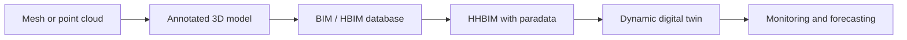

# BIM, HBIM, HHBIM, And Digital Twins

## Purpose
Explain the report's bridge from static 3D records to dynamic digital twins.

## Core Claim
BIM treats a building as a database of interlinked components and information. HBIM extends this to heritage structures. HHBIM adds holistic process and contextual documentation. A digital twin is more dynamic: a living state model linked to behavior, monitoring, maintenance, fault detection, and risk scenarios.

## Agent Takeaways
- Do not call any 3D model a digital twin.
- A digital twin requires state, history, context, behavior, updates, and uncertainty.
- BIM/HBIM are semantic databases, not merely drawings.
- HHBIM is important because it brings paradata into the structure.

## Paper Grounding
- Section 5.6, report p. 86: BIM supports design, delivery, and maintenance through building life cycle.
- Section 5.6, report p. 86: BIM/HBIM should be understood as databases of interlinked data structures and related information.
- Section 5.6, report p. 86: HHBIM combines object data, digital data, technical specifications, paradata, metadata, actors, and storytelling.
- Section 5.6, report p. 86: digital twins are dynamic virtual replicas linked to behavior, monitoring, fault detection, protection planning, and climate risk scenarios.

## Representation Ladder

## Scan-To-HBIM-To-XR
The Time Machine/HBIM material adds a practical chain: measured capture becomes Scan-to-HBIM, then semantic components, then documentation, monitoring, and sometimes XR/public access. The useful distinction is between:

- **LOD/LOG**: how detailed or geometrically faithful a component is;
- **GOA/accuracy gates**: whether the geometry is accurate enough for the intended use;
- **paradata**: why a component was modeled or simplified the way it was;
- **monitoring state**: whether later measurements can update or challenge the model.

An HBIM wall, vault, or beam can be a measured survey object, a conservation record, a simulation component, a public XR asset, or a forecast target. Agents must not assume those uses have the same quality requirements.

## Data-Space And Twin Infrastructure
EUreka3D and 3DBigDataSpace are not BIM systems, but they show the infrastructure around future twins: raw sensor data, multiple model versions, web-viewer derivatives, EDM metadata, paradata links, PIDs/stable IDs, rights statements, validation, AI enrichment, XR, and 3D/4D access. The project should use this as a publication and packaging model, while keeping the twin stricter than a public asset gallery.

Sources: [EUreka3D Data Hub](https://eureka3d.eu/eureka3d-data-hub/), [3DBigDataSpace](https://3dbigdataspace.eu/), and [3DBigDataSpace Europeana PRO](https://pro.europeana.eu/project/3dbigdataspace).

## Future-State Imaging Implication
Future-state rendering belongs at the digital-twin level, not the mesh level. The system needs:

- current geometry;
- material and condition state;
- component relationships;
- sensor updates;
- prior states;
- environmental context;
- transition assumptions;
- uncertainty.

## Evidence / Inference / Visualization
A BIM wall object may contain measured geometry, inferred material, historical interpretation, repair notes, and display textures. Agents must preserve which attributes are evidence, which are inferred, and which are visualization.

## Practical Rule
A high-quality model is not a twin until it can be updated, compared, reasoned over, and validated against the physical entity.
