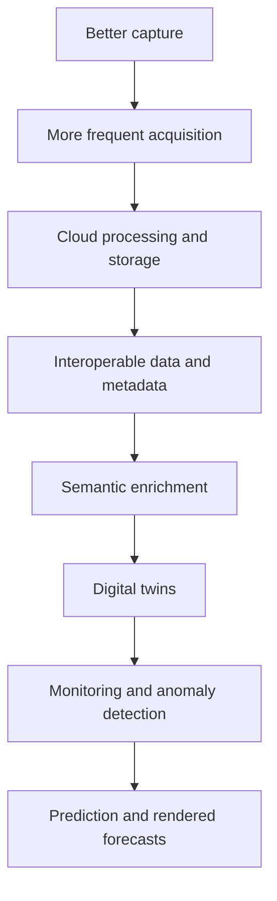

# AI, ML, And Future Technology

## Purpose
Summarize the report's future-technology section and interpret it as a coherent path toward AI-assisted digital twins.

## Core Claim
The report does not claim AI will predict the future by itself. It does point toward AI systems that can classify, enrich, register, monitor, mine, and eventually predict changes in complex 3D environments.

## Agent Takeaways
- Treat XR, cloud, mobile LiDAR, compression, open data, BIM, and AI/ML as parts of one infrastructure shift.
- Use AI first for classification, registration support, semantic enrichment, QC, and anomaly detection.
- Prediction requires temporal data and validation, not generic image generation alone.
- Keep AI outputs labeled as inference unless independently measured.

## Paper Grounding
- Section 5, report pp. 83-88: future technologies include XR, metaverse, 5G/mobile, LiDAR, JPEG XL, BIM/HBIM/HHBIM/digital twins, cloud, open data, AI/ML, and blockchain.
- Section 5.3-5.4, report pp. 85-86: 5G, mobile sensors, smartphone LiDAR, and autonomous-vehicle LiDAR development can improve monitoring and digital-twin workflows.
- Section 5.7, report pp. 87: cloud repositories support large scan data, semantic enrichment, visualization, metadata/paradata import/export, and linked media.
- Section 5.9, report p. 87: AI/ML can automate Scan-to-BIM, classify point-cloud features, enrich metadata/paradata, analyze high-dimensional data, support predictions, and enable near-real-time responses.

## Coherent Technical Path

## AI Enrichment Before AI Prediction
The near-term AI layer is not a universal future-image model. It is a set of enrichment and organization tools that make measured reality queryable:

- image and point-cloud segmentation;
- open-vocabulary object and material search;
- Scan-to-BIM/HBIM assistance;
- metadata and paradata enrichment;
- quality-control triage;
- registration assistance and correspondence search;
- anomaly detection;
- retrieval across repeated states and historical evidence.

Only after those layers produce comparable state estimates does prediction become a defensible research task. [AI for 3D Digital Twins in Cultural Heritage](https://digital-strategy.ec.europa.eu/en/library/ai-3d-digital-twins-cultural-heritage-event-highlights) `primary/institutional` is useful as a policy signal: AI is being attached to digitisation, enrichment, and reuse. It should not be read as proof that arbitrary scan archives can already yield validated future forecasts.

## Model Categories
Useful model families are aligned with different stages:

| Category | Role | Caveat |
| --- | --- | --- |
| Reconstruction models | camera poses, depth, point maps, geometry. | must be checked against survey control when metric claims matter. |
| Radiance fields and splats | novel-view rendering and inspection. | excellent visualization; not enough provenance by themselves. |
| Segmentation/foundation vision | masks, labels, retrieval, semantic grouping. | labels are inference and can be wrong with unusual materials or heritage surfaces. |
| Point-cloud learning | semantic and instance classification, anomaly cues. | needs domain adaptation, calibration, and uncertainty. |
| Temporal models | transition dynamics, next-state hypotheses. | require repeated observations and validation. |
| World/scenario models | rollout of plausible states under constraints. | useful only when constrained by measured state, physics, and evidence graph. |

Representative sources include [NeRF](https://arxiv.org/abs/2003.08934), [3D Gaussian Splatting](https://repo-sam.inria.fr/fungraph/3d-gaussian-splatting/), [D-NeRF](https://openaccess.thecvf.com/content/CVPR2021/html/Pumarola_D-NeRF_Neural_Radiance_Fields_for_Dynamic_Scenes_CVPR_2021_paper.html), [4D Gaussian Splatting](https://openaccess.thecvf.com/content/CVPR2024/html/Wu_4D_Gaussian_Splatting_for_Real-Time_Dynamic_Scene_Rendering_CVPR_2024_paper.html), [OpenMask3D](https://openmask3d.github.io/), and [Pointcept](https://github.com/Pointcept/Pointcept).

## Time Machine Link
The Time Machine corpus supplies a different AI problem from ordinary 3D reconstruction. It implies AI systems that ingest archives, OCR/HTR outputs, maps, photographs, 3D scans, gazetteers, and institutional metadata, then align them into a 4D evidence graph. In that frame, AI supports:

- extracting entities and dates from archival records;
- geocoding historical names and uncertain places;
- linking photographs, plans, scans, and text to the same object/site;
- proposing missing geometry or alternate historical states;
- ranking evidence strength;
- rendering navigable 4D views.

Those tasks are adjacent to future-state imaging because they build the retrospective half of the state history. They do not remove the need for uncertainty and validation.

## Future-State Imaging Implication
The report's AI/ML section is the beginning of the pipeline:

- label point clouds and images;
- register and merge multi-sensor data;
- infer semantic objects and conditions;
- monitor changes;
- detect anomalies;
- learn transition dynamics from repeated states;
- generate visual forecasts constrained by measured reality.

Dynamic NeRFs and 4D Gaussian splats are especially relevant to forecast playback. They can represent changing scenes and render them from novel viewpoints. For this project, they should be treated as possible visualization or representation layers for an ensemble of plausible trajectories, not as standalone predictive engines.

## Evidence / Inference / Visualization
AI can help organize and interpret evidence, but its outputs must be tracked. A segmentation mask, material label, crack forecast, or generated texture is inference until validated.

## Limits And Counterweights
- Low-quality or non-comparable captures will produce unstable predictions, even with strong models.
- Training data from unrelated buildings, stones, climates, or capture devices can create misleading priors.
- Photorealistic AI output can hide weak evidence unless uncertainty is visualized.
- A world model constrained by sensor evidence is still a model. It learns transition dynamics over observed or simulated states; it does not measure unobserved future reality.

## Practical Rule
Use AI to make the measured world queryable, comparable, and testable before using AI to render possible futures.
