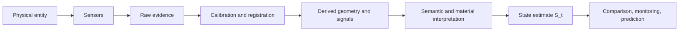

# Scan As State Estimate

## Purpose
Define the central abstraction that turns a scan from a visual artifact into the first layer of a predictive physical system.

## Core Claim
A scan is a state estimate: a partial, uncertain, instrument-mediated description of a physical entity at a specific time.

## Agent Takeaways
- Never treat a scan as the thing itself.
- A useful state estimate includes geometry, appearance, material signals, semantic labels, environment, provenance, and uncertainty.
- The target object is not "a model"; it is `S_t`, the estimated state at time `t`.
- Future-state rendering depends on comparing and modeling changes between states.

## Paper Grounding
- Section 2.2, report p. 6: accuracy and precision distinguish truth-closeness from repeatability.
- Section 2.4-2.6, report pp. 8-18: multiple capture methods sample geometry, appearance, material, internal structure, spectra, and surface behavior.
- Section 3.12.1, report p. 71: uncertainty arises from many measurement and process sources.
- Section 5.6, report p. 86: digital twins link virtual replicas to physical behavior and dynamics.

## State Estimate Model
```text
S_t =
  geometry
  + appearance
  + material_state
  + semantic_structure
  + environment
  + provenance
  + uncertainty
```

The state estimate is not one file. It is a bundle of raw evidence, derived representations, metadata, paradata, and confidence.

## From State Estimate To Evidence Graph
The Time Machine material expands the state estimate into an evidence graph. A scan estimates the physical state at one time. A 4D evidence system links that state to:

- previous measured states;
- archival photographs, maps, plans, and texts;
- historical place and object identifiers;
- semantic components and material labels;
- environmental drivers;
- inferred or hypothetical reconstructions;
- forecast visualizations and validation results.

The important constraint is that these graph nodes do not have the same evidential status. A measured point cloud, a historical map, an AI-suggested missing surface, and a rendered forecast can all be linked to the same entity, but the graph must preserve which one is evidence, inference, or visualization.

## Data Flow


## Future-State Imaging Implication
Future rendering begins by rendering from a current state estimate. The system is not asking, "What should this look like?" It is asking, "Given measured state `S_t`, uncertainty `U_t`, and learned or specified transition dynamics, what states are plausible at `t+n`?"

## Evidence / Inference / Visualization
- Evidence: sensor readings and calibration data.
- Inference: reconstructed geometry, semantic labels, material state.
- Visualization: mesh, splat, render, future image.

## Design Principle
Every future image must be traceable back to the state estimate that constrained it.
