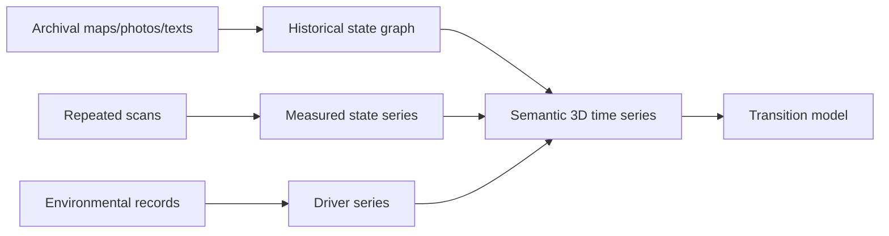

# Semantic 3D Time Series

## Purpose
Describe the transition from isolated scans to temporal data that can support monitoring and prediction.

## Core Claim
One scan is a state. Multiple registered scans are a trajectory. Multiple registered and semantically annotated scans are a semantic 3D time series.

## Agent Takeaways
- Prediction requires temporal data, not just dense capture.
- Registration across time is mandatory for change detection.
- Semantics make change meaningful: "this crack widened" is stronger than "some points moved."
- Temporal capture should include environmental context.

## Paper Grounding
- Section 2.8, report pp. 19-20: registration depends on shared features and redundant observations; modifications between surveys can affect registration.
- Section 3.5, report p. 47: georeferencing and control networks can support long-term observation and structural health monitoring.
- Section 3.12, report pp. 67-70: quality includes structural health, material, scale, geometry, texture, and spectral parameters.
- Section 5.6, report p. 86: digital twins support continuous monitoring, maintenance, and risk scenarios.

## Time-Series Structure
```text
T = [
  S_0, S_1, S_2, ... S_n
]

where each S_t includes:
  measured state
  semantic labels
  environmental context
  uncertainty
  provenance
```

## Historical And City-Scale Scaffolds
The Time Machine sources widen "time series" beyond repeated scans. A semantic 3D time series can combine measured physical captures with historical GIS, temporal gazetteers, archival maps, photographs, plans, texts, and prior reconstructions. These records are not all equivalent evidence, but they can become a temporal scaffold.

Useful external anchors:

- [World Historical Gazetteer](https://www.whgazetteer.org/) `primary/project`: linked historical place records for place/time alignment.
- [World Historical Gazetteer docs](https://docs.whgazetteer.org/) and [Linked Places Format](https://github.com/LinkedPasts/linked-places-format) `primary/project/spec`: GeoJSON-LD-style place attestations with citations and temporal scoping.
- [Pleiades](https://pleiades.stoa.org/places) and [PeriodO](https://perio.do/technical-overview/) `primary/academic`: place and period authority precedents where time is often approximate or contested.
- [Harvard Temporal Gazetteer](https://gis.harvard.edu/temporal-gazetteer) `primary/project`: search/API pattern for historical placenames.
- [Pelagios tools/resources](https://pelagios.org/lod/tools-resources) `primary/project`: linked open-data tools for annotating and connecting historical places.
- [Arches](https://www.archesproject.org/welcome/) `primary/project`: geospatial heritage inventory platform that can act as a semantic management layer.
- [OpenHistoricalMap](https://www.openhistoricalmap.org/) `primary/community`: public-domain time-enabled map data with start/end date conventions.
- [Allmaps](https://allmaps.org/) `primary/tool`: IIIF georeference annotations for historical maps.
- [Project PLATEAU](https://www.mlit.go.jp/plateau/en/) and [3D BAG](https://docs.3dbag.nl/en/) `primary/project docs`: city-scale 3D models that show how buildings and urban surfaces can be managed as structured geospatial assets.

The important move is not to pretend that a historical map, a LiDAR scan, and a neural render have the same status. The move is to register them into a shared spatial-temporal frame while preserving their evidence class and uncertainty.



## Identity Through Time
A temporal model has to answer a deceptively hard question: when is something the same thing? Buildings are repaired, renamed, subdivided, demolished, rebuilt, reclad, and re-addressed. Streets move. administrative boundaries change. Objects are restored. A semantic 3D time series should therefore separate:

- persistent entity ID;
- name/address/place attestations;
- geometry version;
- component version;
- material/condition version;
- source citation and confidence;
- temporal validity interval.

This is why historical GIS and temporal gazetteers matter. They preserve identity and uncertainty across time instead of relying on a single current name or coordinate.

## Change-Detection Methods
For measured 3D states, use methods that can separate significant change from noise:

- M3C2 signed distances along local normals;
- M3C2-PM precision maps for photogrammetry clouds;
- registration residuals and alignment uncertainty;
- level-of-detection thresholds such as LoD95;
- 4D change objects or trajectories where repeated captures are dense enough;
- smoothing/filtering only when it preserves uncertainty and does not erase weak early signals.

The core sources are [M3C2](https://arxiv.org/abs/1302.1183), [CloudCompare M3C2](https://cloudcompare.org/doc/wiki/index.php/PluginM3C2), and [PDAL M3C2](https://pdal.org/en/latest/stages/filters.m3c2.html).

## What Changes Can Mean
| Observed change | Possible interpretation |
| --- | --- |
| point-cloud displacement | deformation, registration error, vegetation, sensor drift. |
| texture darkening | moisture, shadow, dirt, pigment change, exposure change. |
| thermal anomaly | heat leak, void, moisture, active device, sunlight memory. |
| spectral shift | material change, coating, restoration, sensor/lighting difference. |
| crack mask growth | structural movement, surface loss, better capture resolution. |

## Future-State Imaging Implication
Temporal data lets the system learn or encode transition dynamics. For example:

- crack width over time;
- material weathering rate;
- moisture recurrence after rain;
- facade deformation;
- vegetation growth/occlusion;
- thermal anomaly persistence.

At object scale, the state series might be three scans of a wall and humidity logs. At city scale, it might be historical parcels, photographs, facade scans, traffic exposure, flood history, and repairs. The same principle holds: a future-state rendering is only meaningful where the temporal scaffold is comparable and the uncertainty is explicit.

## Evidence / Inference / Visualization
Change detection must separate measured difference from inferred condition. A heat anomaly is evidence. "Moisture intrusion" is an inference. A future wetness map is a forecast visualization.

## Practical Rule
No meaningful future-state rendering without a comparable past-state series.
