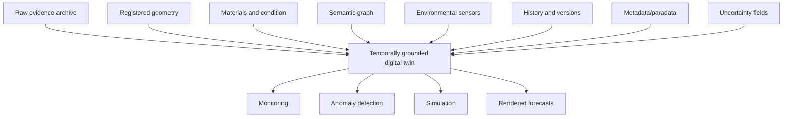
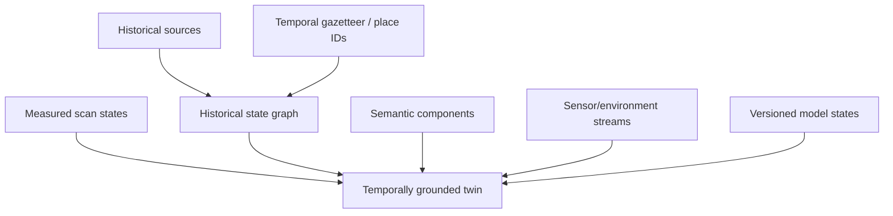

# Temporally Grounded Digital Twin

## Purpose
Define the kind of digital twin this project needs: not a static asset, but a changing, evidence-constrained state model.

## Core Claim
A temporally grounded digital twin is a living model of a physical entity that stores geometry, material state, semantic structure, sensor data, environmental context, history, provenance, and uncertainty.

## Agent Takeaways
- A digital twin is not a mesh, point cloud, or Gaussian splat by itself.
- The twin must know when evidence was captured and how it changed.
- The twin should support monitoring, anomaly detection, simulation, maintenance, and forecasting.
- The twin is the substrate for rendered forecasts.

## Paper Grounding
- Section 5.6, report p. 86: a digital twin is a virtual replica linked to the dynamics of the physical entity.
- Section 5.6, report p. 86: digital twins are relevant for monitoring, maintenance, fault detection, protection planning, and climate risk.
- Section 4.4, report pp. 79-82: interoperability and preservation require metadata and process information.
- Section 5.7, report p. 87: cloud systems can support semantic enrichment, visual analysis, metadata/paradata, and linked media.

## Twin Components

## Representation Is Not The Twin
A twin can contain meshes, point clouds, voxel grids, NeRFs, Gaussian splats, BIM/HBIM components, CityGML/CityJSON objects, and image layers. None of those representations is the twin by itself. The twin is the versioned state system that knows:

- what was measured;
- when it was measured;
- how it was derived;
- what coordinate frame it belongs to;
- what semantic entity it represents;
- what uncertainty attaches to it;
- what later captures confirmed or contradicted it.

Radiance fields and Gaussian splats are useful views or state encodings inside the twin. They are not sufficient conservation records unless raw captures, calibration, geometry, metadata, paradata, provenance, and uncertainty remain available.

## Historical State Graph
The Time Machine material adds a retrospective layer: a twin can link measured present state to archival maps, photographs, plans, texts, prior repairs, older scans, and historical gazetteer entries. This creates a historical state graph rather than only a live sensor mirror.

For city-scale systems, [CityGML 3.0](https://www.ogc.org/standards/citygml), CityGML Dynamizer concepts, [CityJSON](https://www.cityjson.org/), and [CityJSON versioning](https://www.cityjson.org/experimental/versioning/) are useful scaffolds. They show how semantic city objects, versions, time-varying attributes, sensors, and simulations can be managed without reducing the city to a mesh.

## Minimum Viable Twin
For this project, a first useful twin can be small:

- one bounded object or surface;
- two or more registered captures;
- raw image/LiDAR archive;
- one derived geometry representation;
- semantic annotations for regions of interest;
- environmental notes;
- uncertainty estimate;
- simple change report.

## Future-State Imaging Implication
Future-state rendering should be a view of the twin's predicted state, not a standalone generative image. The twin supplies constraints; the renderer supplies visual form.

## Evidence / Inference / Visualization
The twin should expose evidence and inference separately. A future-state renderer should be able to ask: "Which parts of this predicted crack are measured trend, learned prior, physics assumption, or visual extrapolation?"

## Practical Rule
If the model cannot be updated after a new capture, it is not yet the digital twin needed here.
