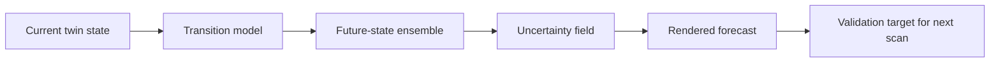

# Future-State Rendering

## Purpose
Define the technically correct version of "generating images of the future."

## Core Claim
Future-state rendering is the visualization of probable future physical states from a temporally grounded digital twin. It is not a measured record of a later state and not evidence that the forecasted state will occur.

## Agent Takeaways
- Use the phrase "rendered forecast" for generated future images.
- Always state what evidence constrains the forecast.
- Render uncertainty with the image, not in a footnote.
- Distinguish future-state rendering from restoration rendering, missing-state rendering, and alternate-state rendering.

## Paper Grounding
- Section 5.6, report p. 86: digital twins support monitoring, fault detection, protection planning, and risk scenarios.
- Section 5.9, report p. 87: AI/ML may enable predictions and near-real-time responses from high-dimensional data.
- Section 3.12.1, report p. 71: uncertainty should be evaluated and expressed.

## Forecast Types
| Forecast | Output |
| --- | --- |
| Geometry forecast | deformation, crack growth, surface loss, displacement. |
| Texture forecast | weathering, staining, fading, biological growth. |
| Material-state forecast | moisture, corrosion, delamination probability. |
| Thermal forecast | heat anomaly or insulation/failure pattern. |
| Restored-state hypothesis | plausible prior state under conservation assumptions. |
| Missing-state hypothesis | occluded or inaccessible geometry/material. |
| Alternate-state rendering | scenario conditioned on repair, climate, use, or intervention. |

## Playback Representations
Future-state rendering can be output through several representations:

- mesh deformation sequence;
- point-cloud displacement and confidence layers;
- texture/material forecast frames;
- thermal or moisture probability maps;
- dynamic NeRF or radiance-field playback;
- 4D Gaussian splat sequence;
- XR/virtual museum scenario view;
- 3D Tiles or city-viewer layer for site-scale scenarios.

Dynamic radiance fields and 4D Gaussian splats are attractive because they can display changing scenes from novel viewpoints. Sources such as [D-NeRF](https://openaccess.thecvf.com/content/CVPR2021/html/Pumarola_D-NeRF_Neural_Radiance_Fields_for_Dynamic_Scenes_CVPR_2021_paper.html) and [4D Gaussian Splatting](https://openaccess.thecvf.com/content/CVPR2024/html/Wu_4D_Gaussian_Splatting_for_Real-Time_Dynamic_Scene_Rendering_CVPR_2024_paper.html) are relevant as representation and playback methods. They do not, by themselves, supply measured transition dynamics.

## Rendering Pipeline


## Future-State Imaging Implication
The goal is not to make an image that looks inevitable. The goal is to make a visualization that helps researchers, builders, conservators, or agents reason about likely change and uncertainty.

The Time Machine and virtual-museum material is useful because it treats 4D scenes as navigable information systems. For this project, a forecast viewer should let a user move among measured states, inferred intermediate states, forecast ensembles, and source evidence. It should not present the future-state render as a single final answer.

## Scenario Engines
A scenario engine is a constrained generator over state variables:

```text
current state + prior states + environment + intervention + transition assumptions
  -> ensemble of plausible trajectories
  -> rendered forecast package
```

Examples:

- no intervention vs repaired surface;
- dry season vs repeated rain exposure;
- current load pattern vs altered structural load;
- conservative material-loss rate vs high-risk rate;
- restored-state hypothesis vs documented present state.

Each scenario must identify which variables are measured, assumed, inferred, or generated. A scenario image is a view of a conditional model, not evidence that the condition will occur.

## Evidence / Inference / Visualization
A future-state image should carry metadata:

- source states used;
- sensor modalities used;
- model or transition rule;
- forecast horizon;
- uncertainty layer;
- validation status;
- regions that are measured trend vs generated hypothesis.

## Practical Rule
Do not render certainty unless the system has earned certainty. Most future images should include probability defocus, confidence overlays, or ensemble variants.
