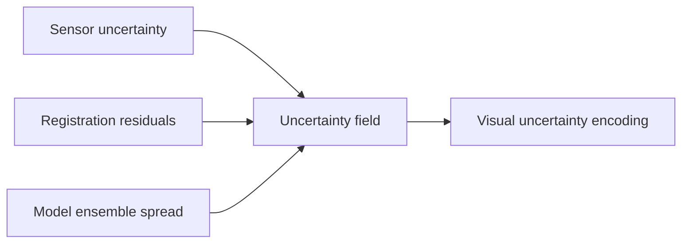

# Uncertainty Visualization

## Purpose
Define visual strategies for showing uncertainty in current state estimates and future-state renderings.

## Core Claim
Uncertainty should be visible. A sharp photorealistic render can be misleading if it hides weak evidence, registration ambiguity, semantic uncertainty, or divergent future trajectories.

## Agent Takeaways
- Render stable regions sharply and uncertain regions with probability defocus.
- Use confidence maps, ensembles, contours, flow, and alternate states.
- Treat pixel sorting and similar effects as analytical metaphors only when tied to uncertainty data.
- Never use visual polish to imply certainty.

## Paper Grounding
- Section 3.1, report pp. 25-26: uncertainty should be expressible and transferable.
- Section 3.12.1, report p. 71: uncertainty sources include equipment, environment, personnel, assumptions, and repeated observations.
- Section 4.2, report pp. 74-77: some formats, such as PLY, can carry confidence values; format choice affects preserved information.

## Visualization Modes
| Mode | Use |
| --- | --- |
| Confidence heatmap | show where the state estimate is strong or weak. |
| Probability defocus | make uncertain forecast regions blur, soften, or dissolve. |
| Ensemble grid | show multiple plausible trajectories side by side. |
| Difference field | show measured or forecast displacement/change magnitude. |
| Contour bands | show confidence intervals over geometry or material fields. |
| Directional flow | show expected movement, moisture path, crack direction, or deformation. |
| LIC-like texture | show directional instability or flow in scalar/vector fields. |
| Pixel sorting | aesthetic/analytical signal for temporal instability, never proof. |

## Evidence Scales
Uncertainty is not only numeric. Some reconstructed or forecasted regions have strong measurement support; others are source-based, analogical, or speculative. Use an evidence scale beside quantitative confidence:

| Evidence level | Visualization treatment |
| --- | --- |
| measured with control | sharp geometry; numeric confidence available. |
| measured without strong control | sharp but marked with lower metric authority. |
| source-documented | visible source link or source-projection overlay. |
| inferred from nearby evidence | semi-sharp; show inference class and rationale. |
| analogical | visibly distinct; show comparison source. |
| hypothetical or AI-suggested | defocused, ghosted, or alternate-state only. |

The [London Charter](https://londoncharter.org/introduction.html) and [Seville Principles](https://www.vi-mm.eu/wp-content/uploads/2016/10/The-Seville-Principles.pdf) are the core guidance here: visualization should not hide the difference between evidence, inference, probability, and uncertainty.

## M3C2 And Level Of Detection
For point-cloud change, uncertainty should be spatially local. M3C2-style methods estimate signed distances between clouds along local normals and can express whether detected change exceeds an uncertainty threshold. In practice:

- apparent displacement below the level of detection should not drive a forecast as real change;
- registration error and local roughness/precision should be part of the uncertainty field;
- M3C2-PM precision maps are especially relevant for photogrammetry-derived clouds;
- M3C2-EP-style error propagation is a useful target when per-point measurement/alignment uncertainty is available.

Sources: [Lague et al. M3C2](https://arxiv.org/abs/1302.1183), [CloudCompare M3C2](https://cloudcompare.org/doc/wiki/index.php/PluginM3C2), and [PDAL M3C2 filter](https://pdal.org/en/latest/stages/filters.m3c2.html).

## Future-State Imaging Implication
The most honest future image may not be a single image. It may be:

- an average over plausible trajectories;
- a sharp/blurred confidence composite;
- a slider from conservative to high-risk forecast;
- a linked image plus uncertainty map;
- an ensemble with scored probabilities.

For a rendered forecast, probability defocus should be data-driven where possible:

- stable measured regions remain visually crisp;
- low-confidence geometry softens or braids across ensemble alternatives;
- high-variance material forecasts become translucent or multi-hued;
- expected directional movement can be shown as flow;
- regions outside model support should dissolve rather than pretend to be known.

Recent FAIR 3D research on visual credibility and transparency argues for preserving model versions and visualizing operator interventions/uncertainty directly on geometry: [Balancing Visual Credibility and Transparency](https://peercommunityjournal.org/articles/10.24072/pcjournal.696/) `peer-reviewed`.

## Evidence / Inference / Visualization
Uncertainty visualization is visualization, but it should be driven by evidence and inference fields:

## Practical Rule
The more beautiful the render, the more explicit the uncertainty layer must be.
