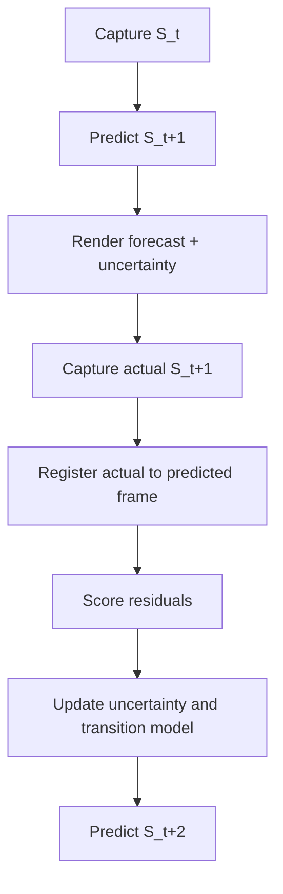

# Validation Loop

## Purpose
Define the scientific loop that turns future-state rendering from speculation into a testable research practice.

## Core Claim
The system becomes scientific when it predicts the next measurable state, captures that later state, registers it, scores error, and updates the model.

## Agent Takeaways
- Forecasts must be scored, not merely admired.
- The next scan is the ground truth test for the previous forecast.
- Validation must compare state variables, not only images.
- Failed predictions are useful if they improve the transition model.

## Paper Grounding
- Section 2.2, report p. 6: repeatability and measurement accuracy are essential.
- Section 3.1 and 3.12.1, report pp. 25-26 and 71: uncertainty intervals and repeated observations matter.
- Section 5.6, report p. 86: digital twins support monitoring and maintenance.
- Section 5.9, report p. 87: AI/ML can support predictions and critical event processing.

## Validation Flow

## Scoring Targets
| Target | Possible metric |
| --- | --- |
| geometry | point-to-point distance, M3C2, M3C2-PM, mesh distance, displacement field, LoD95 significance. |
| segmentation | IoU, precision/recall, semantic consistency. |
| material state | classification accuracy, spectral residual, anomaly persistence. |
| thermal state | temperature residual, anomaly localization, temporal correlation. |
| forecast uncertainty | calibration: did actual change fall inside predicted interval? |
| visualization | whether uncertainty was communicated without overstating certainty. |

## Geometric Validation Backbone
For repeated scans, the validation loop should start with point-cloud change methods before jumping to image similarity. M3C2 is a baseline because it measures signed distance along local surface normals and includes local confidence. M3C2-PM adds precision maps for photogrammetry/SfM point clouds. M3C2-EP-style methods extend this by propagating measurement and alignment uncertainty.

Practical validation records should store:

- registration transform and residuals;
- point spacing, local roughness, and normal scale;
- per-point precision if available;
- registration uncertainty;
- LoD95 or equivalent detection threshold;
- significant-change flags;
- forecast residuals after the next scan.

Useful sources: [M3C2 original paper](https://arxiv.org/abs/1302.1183), [CloudCompare M3C2 plugin](https://cloudcompare.org/doc/wiki/index.php/PluginM3C2), [PDAL M3C2 filter](https://pdal.org/en/latest/stages/filters.m3c2.html), and [USGS M3C2-PM repeat survey data](https://www.usgs.gov/data/inputs-and-outputs-3d-point-cloud-comparisons-m3c2-repeat-bathymetric-and-topographic-surveys).

## Benchmark And Dataset Anchors
Public datasets can test pieces of the loop before the project has its own long time series:

- [OpenHeritage3D](https://openheritage3d.org/data): open 3D heritage survey data with metadata/paradata expectations.
- [CULTURE3D](https://memories.ai/research/CULTURE3D): cultural landmark reconstruction and Gaussian-splat benchmarking.
- [Kijkduin 4D TLS dataset](https://www.nature.com/articles/s41597-022-01291-9): dense repeated point clouds for 4D change/forecasting experiments.
- [ISPRS Benchmarks](https://www.isprs.org/resources/datasets/benchmarks/): remote-sensing and photogrammetry validation culture.
- [Dazu Rock Carvings hyperspectral dataset](https://www.nature.com/articles/s41597-025-06158-3): material deterioration classes and spectral data.
- [SWIR porous-stone moisture dataset](https://zenodo.org/records/17726161): moisture maps and hyperspectral data for stone/brick.
- [SDNET2018](https://digitalcommons.usu.edu/all_datasets/48) and [CODEBRIM](https://arxiv.org/abs/1904.08486): crack and infrastructure defect datasets; useful as priors, not heritage truth.
- [Z24 Bridge SHM benchmark](https://bwk.kuleuven.be/bwm/z24) and [NTNU SHM open data](https://www.ntnu.edu/kt/open-data): structural-health time-series analogs.

No single dataset supplies the whole future-state imaging stack. The research task is to connect measured geometry, material-state signals, semantics, environment, uncertainty, and later validation.

## Probabilistic Forecast Scoring
A rendered forecast should be scored as a probabilistic claim where possible. Useful ideas from probabilistic forecasting include calibration, sharpness, proper scoring rules, continuous ranked probability score, and ensemble spread. See [Probabilistic Forecasting review](https://www.annualreviews.org/content/journals/10.1146/annurev-statistics-062713-085831) and [scoringRules](https://www.jstatsoft.org/v090/i12).

For this project:

- geometric ensembles should be checked against later measured displacement;
- material-state probabilities should be checked against later spectral/thermal/manual observations;
- uncertainty intervals should be tested for coverage;
- overconfident renders should be penalized even when they look plausible.

## Future-State Imaging Implication
The rendered forecast should be saved as a hypothesis with:

- forecast date;
- target date or horizon;
- input states;
- assumptions;
- model version;
- uncertainty field;
- validation result once the next capture exists.

## Evidence / Inference / Visualization
Validation is the mechanism that reconnects visualization to evidence. A forecast becomes useful when it can be wrong in measurable ways.

## Practical Rule
The next capture is part of the model.
